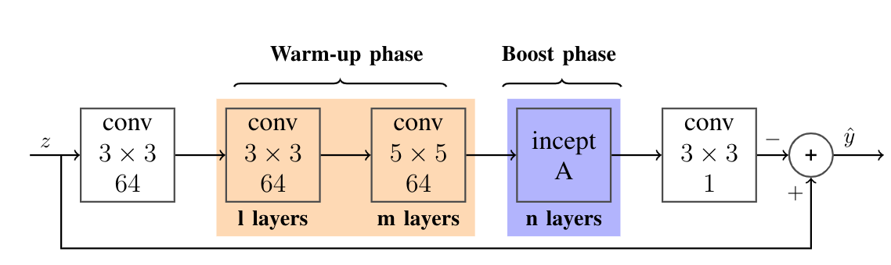
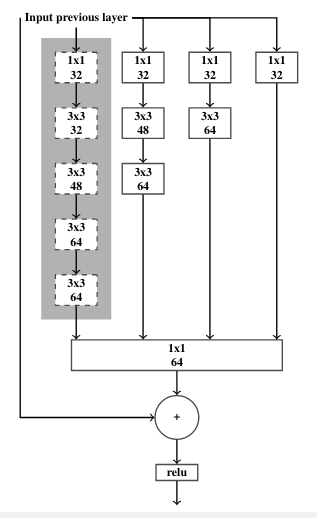
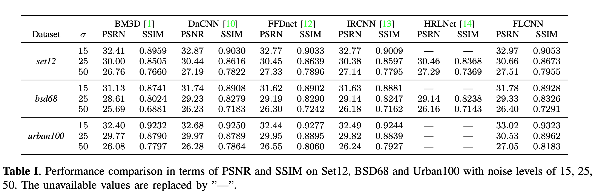

# FlashLight CNN
<small>Version 1.0, 2020-02-02</small>
---
Preliminary version: https://arxiv.org/abs/2003.00762

 We propose  a  learning-based  denoising  method called  FlashLight  CNN  (FLCNN)  that  implements  a  deep neural network for image denoising. The proposed approach is based on  deep residual networks and inception  networks and it is able to leverage many more parameters than residual networks alone for denoising grayscale images corrupted by additive  white  Gaussian  noise  (AWGN).  FlashLight  CNN demonstrates  state  of  the  art  performance  when  compared quantitatively  and  visually  with  the  current  state  of  the  art image denoising methods:

## Network Architectures!
FlashLightCNN  is  made  up  two  phases:warm up and boost phases,with a residual skip connection between the input and the output.
 The __warmup__ phase uses only __conventional__ convolutional layers and resembles a __typical__  cnn. The __boost__ phase on the other hand, uses much wider residual inception layers that rapidly increase the number of parameters of the network  while avoiding the dimishing feature reuse that would come with it if only conventional convolutional layers would be employed.

---
The boost phase implements the customized residual inception layers that designed to maintain the learning capacity of great deep neural networks as show in the figure below

## Evaluation models!
The models used for valuating can be downloaded  [here](./evaluation_models)

### Result
## Gaussian Denoising

## REFERENCES
[1]  K.  Dabov,  A.  Foi,  V.  Katkovnik,  and  K.  Egiazar-ian,  “Image denoising by sparse 3-d transform-domain
collaborative  filtering,”IEEE  Transactions  on  ImageProcessing, vol. 16, no. 8, pp. 2080–2095, aug 2007.

[12]  Kai  Zhang,  Wangmeng  Zuo,  and  Lei  Zhang,   “FFD-Net:  Toward  a  fast  and  flexible  solution  for  CNN-based image denoising,”IEEE Transactions on ImageProcessing, vol. 27, no. 9, pp. 4608–4622, sep 2018.

[13]  Kai  Zhang,  Wangmeng  Zuo,  Shuhang  Gu,  and  LeiZhang,  “Learning deep CNN denoiser prior for imagerestoration,”   in2017  IEEE  Conference  on  ComputerVision   and   Pattern   Recognition   (CVPR).   jul   2017,IEEE.

[14]  Wuzhen Shi, Feng Jiang, Shengping Zhang, Rui Wang,Debin  Zhao,  and  Huiyu  Zhou,   “Hierarchical  residuallearning  for  image  denoising,”Signal  Processing:Image Communication, vol. 76, pp. 243–251, aug 2019
